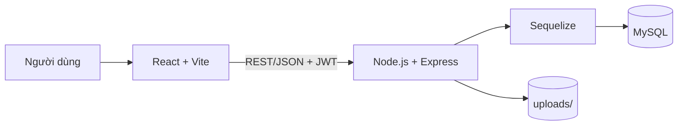
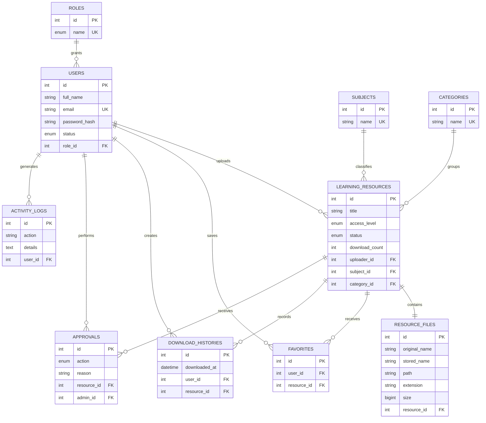
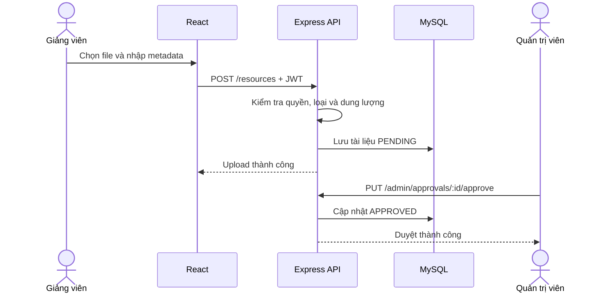

# Biểu đồ hệ thống

## Kiến trúc tổng thể

```mermaid
flowchart LR
  U["Người dùng"] --> R["React + Vite"]
  R -->|"REST/JSON + JWT"| E["Node.js + Express"]
  E --> S["Sequelize"]
  S --> M[("MySQL")]
  E --> F[("uploads/")]
```

## ERD đầy đủ

```mermaid
erDiagram
  ROLES {
    int id PK
    enum name UK
  }
  USERS {
    int id PK
    string full_name
    string email UK
    string password_hash
    enum status
    int role_id FK
  }
  SUBJECTS {
    int id PK
    string name UK
  }
  CATEGORIES {
    int id PK
    string name UK
  }
  LEARNING_RESOURCES {
    int id PK
    string title
    enum access_level
    enum status
    int download_count
    int uploader_id FK
    int subject_id FK
    int category_id FK
  }
  RESOURCE_FILES {
    int id PK
    string original_name
    string stored_name
    string path
    string extension
    bigint size
    int resource_id FK
  }
  FAVORITES {
    int id PK
    int user_id FK
    int resource_id FK
  }
  DOWNLOAD_HISTORIES {
    int id PK
    datetime downloaded_at
    int user_id FK
    int resource_id FK
  }
  APPROVALS {
    int id PK
    enum action
    string reason
    int resource_id FK
    int admin_id FK
  }
  ACTIVITY_LOGS {
    int id PK
    string action
    text details
    int user_id FK
  }
  ROLES ||--o{ USERS : grants
  USERS ||--o{ LEARNING_RESOURCES : uploads
  SUBJECTS ||--o{ LEARNING_RESOURCES : classifies
  CATEGORIES ||--o{ LEARNING_RESOURCES : groups
  LEARNING_RESOURCES ||--|| RESOURCE_FILES : contains
  USERS ||--o{ FAVORITES : saves
  LEARNING_RESOURCES ||--o{ FAVORITES : receives
  USERS ||--o{ DOWNLOAD_HISTORIES : creates
  LEARNING_RESOURCES ||--o{ DOWNLOAD_HISTORIES : records
  USERS ||--o{ APPROVALS : performs
  LEARNING_RESOURCES ||--o{ APPROVALS : receives
  USERS ||--o{ ACTIVITY_LOGS : generates
```

## Trình tự upload và duyệt

```mermaid
sequenceDiagram
  actor L as Giảng viên
  participant W as React
  participant A as Express API
  participant D as MySQL
  actor X as Quản trị viên
  L->>W: Chọn file và nhập metadata
  W->>A: POST /resources + JWT
  A->>A: Kiểm tra quyền, loại và dung lượng
  A->>D: Lưu tài liệu PENDING
  A-->>W: Upload thành công
  X->>A: PUT /admin/approvals/:id/approve
  A->>D: Cập nhật APPROVED
  A-->>X: Duyệt thành công
```
